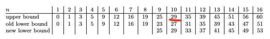
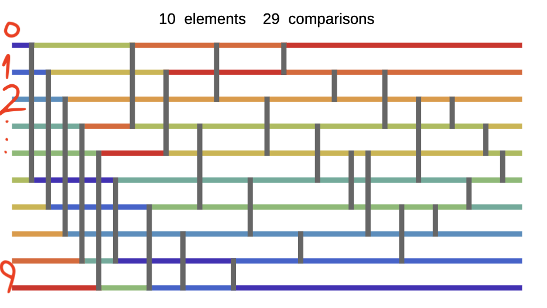

# About the solution

To sort fixed sized arrays, there is a better way than traditional sorting(bubble, quick, merge). Additionally, when it comes to EVM development, we should be thinking about the gas efficiency too.
The way named by **Optimal Sorting Networks**.
For more details about the solution and mathematical proof, please visit [here](https://arxiv.org/pdf/1405.5754.pdf)

Briefly, here is the table from the article that indicates the amount of necessary steps to sort a fixed sized arrays.

I generated the necessary steps by using Wolfram. More details: https://demonstrations.wolfram.com/SortingNetworks/

This was the steps that I had to apply.

