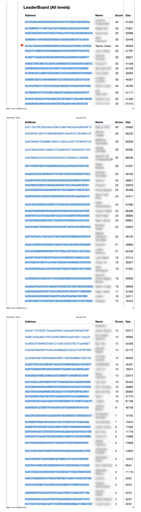

# About this repository

This is a repository that I share my solutions in Expert Solidity Bootcamp by Encode Club.
During all the challenges, **the gas efficiency** was the main purpose.
This is the reason why my PureYul solutions don't have any function signature :)

For most of them, I tried all the different variants.

- Solidity
- Solidity with Inline Assembly
- Pure yul

Even though the pure yul was the best gas efficient way, I found it little bit hard to accomplish. If there will be an ongoing contract, I don't think it would be workable for long term. For most of the cases I found the Solidity and Inline Assembly mix was the best.

I have finished the course as fifth of 71 participants.🥳

